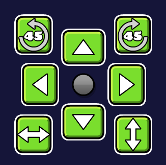
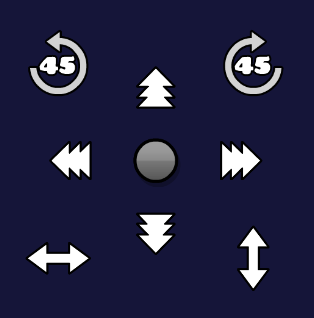

# Quick Move Buttons

> [!TIP]
>
> This mod is primarily intended for mobile users.

This mod adds a scalable and moveable UI to the level editor with move, rotate, and flip buttons to help you save time when transforming objects in the level editor! You can find a button to quickly access this mod's settings in the editor pause menu.

In the mod's settings, you can customize button visuals and functionality.
# Credits
- CyanBoi: For beta testing and finding bugs along the way
- Cheeseworks: For helping me make this mod possible since I barely understand some functionality to make things work
# Known Bugs
- Buttons disappears whenever you copy + paste multiple objects. Appears again whenever you move your editor *(Best way to prevent this is enabling Button Presistent since I don't know how to fix this bug)*
# How to use
- Select an object to show the transform buttons in the editor.
- Hold around the edge of the buttons to drag around the buttons.
# Preview

