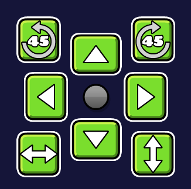
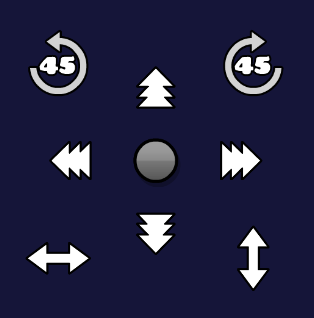

# Quick Move Buttons

> [!TIP]
>
> This mod is primarily intended for mobile users, but supports all platforms.

<cg>* This mod is primarily intended for mobile users. But can be used on PC/Mac.*</c>

In the mod's settings, you can customize UI visuals and functionality.

# How to Use
1. Select an object to show the transform buttons in the editor.
2. Hold the draggable area of the buttons to move the menu.
3. Press the center button to toggle the move units.

# Credits
- **[Cheeseworks](https://gdbrowser.com/u/cheeseworks)** - For helping me make this mod possible since I barely understand some functionality to make things work
- **[CyanBoi](https://gdbrowser.com/u/CyanBoi)** - For beta testing, finding bugs and giving me feedbacks
- **[iCreate Pro](https://icreate.pro/)** - For inspiration on the Custom Move Button feature

# Previews

# Known Bugs
- Buttons disappears whenever you copy + paste multiple objects. Appears again whenever you move your editor 
*(You can currently prevent this by enabling `Button Presistent` in the settings)*
